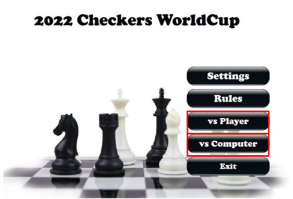
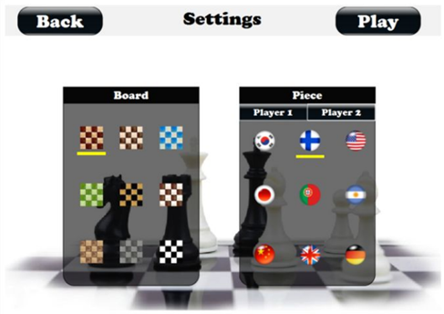
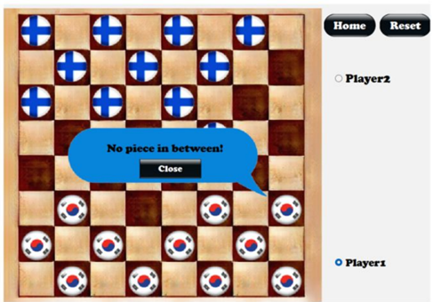

# **2022 Checkers WorldCup - C++ Game**

## **Overview**
This project is a **Checkers game** implemented in **C++**, featuring a **Graphical User Interface (GUI) built with Qt**. The game allows players to compete in an international-themed Checkers tournament, choosing pieces represented by various country flags.

## **Features**
- **Player vs. Computer & Player vs. Player Modes**: Compete against an AI or another player.
- **Graphical User Interface (GUI)**: Stylish and interactive UI built with Qt.
- **Customizable Game Settings**: Select different board styles and national flag-themed pieces.
- **Move Validation & Game Logic**: Ensures legal moves for standard pieces and kings.
- **International Theme**: Players can choose **country flags** as their checkers pieces, adding a unique competitive element.

## **How to Play**
- The game follows standard checkers rules.
- Players can **customize their board and checkers pieces** before starting a match.
- Pieces represent different **national flags**, making the game feel like an international Checkers WorldCup.
- Players take turns moving pieces diagonally.
- Capturing opponent pieces is required when possible.
- Kings can move both forward and backward.
- The game ends when a player has no valid moves left.

## **Future Improvements**
- **AI Enhancement**: Implement **Minimax algorithm** with **Alpha-Beta pruning** for smarter moves.
- **Multiplayer Mode**: Add **online multiplayer functionality**.
- **Leaderboard & Tournament Mode**: Track player progress and rankings.
- **Sound Effects & Animations**: Enhance the visual and audio experience.
